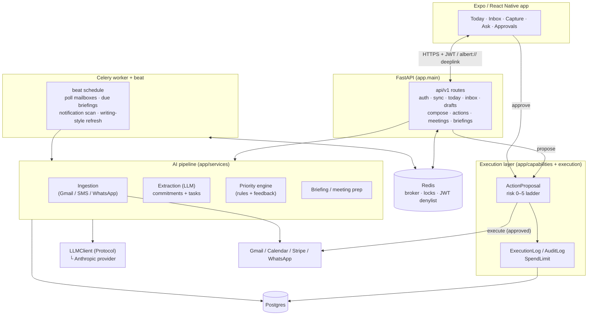

<div align="center">


# Alfred

### An AI chief of staff that reads your inbox, tells you what actually matters today, and drafts the replies — but never acts without your approval.

Alfred connects your Gmail, Google Calendar, SMS, and WhatsApp into one prioritized
inbox. It extracts the commitments and follow-ups hiding in your messages, ranks what
needs attention, prepares drafts and meeting briefs, and executes real-world actions
(sending mail, changing your calendar) only through an explicit, audited,
human-in-the-loop approval ladder.

The thesis: an assistant that touches your email has to earn trust. Alfred is built so
every external action is proposed, approved, logged, and reversible — never silent.

</div>

> **A note on the name.** The product is **Alfred** (the mobile app, the `alfredaitech.com`
> deployment). The codebase and infrastructure still use the original internal name
> **Albert** — you'll see it in Python packages, the Docker Compose project `albert`, the
> `albert_*` containers, the database name, and `/opt/albert` on the server. Same product.

---

## Key features

- **Unified multi-channel inbox** — Gmail today, plus SMS (iOS Shortcut / Android
  forwarder) and WhatsApp Business Cloud API, normalized into one `Message` stream.
- **AI prioritization** — a transparent, rules-based priority engine ranks open work with
  human-readable reasons (no black-box scoring), so "why is this on top?" always has an answer.
- **Commitment & task extraction** — an LLM pass over each conversation surfaces the
  promises, asks, and deadlines buried in threads, with evidence and a confidence score.
- **Approval-gated drafting & sending** — Alfred drafts replies in your learned writing
  style, but sending mail or changing your calendar requires an explicit approval.
- **Proactive follow-ups & meeting briefs** — a waiting-for tracker chases open loops,
  and meeting prep assembles the relevant history before every event with attendees.
- **Daily briefings** — a morning summary of what's due, who's waiting, and what's on the
  calendar, generated per user and persisted for explainability.
- **Capture** — dump messy text or a voice note; Alfred turns it into structured tasks.
- **Learning / feedback loop** — writing style is refreshed from your Sent mail, habits are
  detected from behavior, and briefing/priority feedback is captured to improve ranking.
- **Honest boundaries** — capabilities without a safe, official API (browser automation,
  food-delivery ordering) are *refused in code* with a sourced error, not faked.

---

## Architecture

Alfred is a monorepo: a **FastAPI + Celery** backend, an **Expo / React Native** mobile
app, and a shared TypeScript types package. Postgres is the system of record; Redis is the
Celery broker, the distributed-lock store, and the session-revocation denylist.



### End-to-end flow

```
ingest (Gmail / SMS / WhatsApp)
  → extract commitments & tasks (LLM, tool-use structured output)
    → prioritize (transparent rules + feedback learning)
      → propose action (draft reply, calendar change, send)
        → human approval (risk ladder 0–5)
          → execute (Gmail / Calendar / Stripe / WhatsApp)
            → audit (ExecutionLog + AuditLog, every attempt)
```

**Sync is synchronous now, async-ready.** `POST /api/v1/sync` runs ingestion + extraction
inline so the flow is easy to demo end to end; the identical logic is wrapped in Celery
tasks for production. The beat scheduler (`app/workers/celery_app.py`) drives the
proactive layer:

| Beat task | Cadence | Does |
| --- | --- | --- |
| `albert.poll_all_mailboxes` | every 60s | Poll each connected mailbox, push on new Primary mail |
| `albert.dispatch_due_briefings` | hourly | Generate the morning briefing when a user enters their local morning window |
| `albert.scan_notifications` | every 30 min | Meeting prep + task reminders + stale-waiting nudges, quiet-hours aware |
| `albert.refresh_writing_styles` | weekly (Sun 03:30) | Relearn writing style from Sent mail |

Per-mailbox Gmail sync is guarded by a Redis lock so the beat poller and an interactive
sync can't race on the same `gmail_history_id` cursor. See
[`ARCHITECTURE.md`](./ARCHITECTURE.md) for the reasoning behind each decision.

---

## Tech stack

| Layer | Choices |
| --- | --- |
| **Backend** | Python 3.12, FastAPI, SQLAlchemy 2, Alembic, Celery, Pydantic v2 |
| **Frontend** | Expo / React Native, Expo Router, React Query, TypeScript |
| **Data / infra** | Postgres 16 (`pgvector/pgvector:pg16` in prod), Redis 7, Docker Compose, Caddy (auto-TLS) |
| **LLM** | Provider-agnostic `LLMClient` Protocol; Anthropic Claude (Haiku for classify, Sonnet for extract/draft) via forced tool-use structured outputs |
| **Voice** | Provider-agnostic transcription seam (OpenAI Whisper); degrades to HTTP 501 when unconfigured |
| **Observability** | Sentry, structlog (JSON), Prometheus `/metrics`, `X-Request-ID` correlation, PII log redaction |
| **Security** | Google OAuth (no passwords), Fernet/MultiFernet token encryption at rest, JWT sessions with Redis revocation denylist |
| **Tooling** | `uv` (backend), `bun` (JS), ruff, mypy (strict), pytest, vitest, GitHub Actions CI |

---

## Security highlights

Alfred reads people's email — trust *is* the product. The full write-up is in
[`SECURITY.md`](./SECURITY.md); the spine:

- **Encryption at rest with key rotation.** Google OAuth tokens are encrypted with Fernet
  (AES-128-CBC + HMAC) before they touch Postgres, via **`MultiFernet`** so
  `TOKEN_ENCRYPTION_KEY` can be rotated with no flag-day re-encrypt — old keys live in
  `TOKEN_ENCRYPTION_KEY_PREVIOUS` and are tried only on decrypt.
- **Human-in-the-loop approval spine.** A risk ladder classifies every action
  (`0` read-only → `1` internal prep → `2` reversible write → `3` external comms → `4`
  financial → `5` sensitive). Levels ≥3 require an approved `ActionProposal`; 4–5 require a
  second strong confirmation (HTTP 428). Financial actions check a per-user `SpendLimit`
  (row-locked, idempotency-keyed) and every attempt — success, error, or blocked — writes
  an append-only audit row.
- **JWT sessions with server-side revocation.** Sessions carry a unique `jti`; logout adds
  it to a Redis denylist with a self-expiring TTL. The denylist fails open if Redis is down.
- **Storage minimization.** Raw email bodies are never persisted — only a snippet and
  metadata; the full body is fetched in-process during extraction and discarded.
- **PII log redaction** in structured logs, and an OAuth `state` that is a signed, expiring
  JWT (open-redirect-safe by baking the validated redirect into the signature).

---

## Monorepo layout

```
alfred-ai-cos/
├── backend/                 FastAPI app + AI pipeline + Celery workers
│   ├── app/
│   │   ├── api/v1/           HTTP routes (auth, sync, today, inbox, drafts, compose,
│   │   │                       actions, meetings, briefings, tasks, capture, messages,
│   │   │                       search, senders, schedule_proposals, assistant, me,
│   │   │                       notifications, billing, integrations, dev)
│   │   ├── core/             config, security (JWT + revocation), Redis, logging,
│   │   │                       metrics, observability, PII redaction
│   │   ├── db/               SQLAlchemy models + enums (incl. RiskLevel, ActionType)
│   │   ├── llm/              provider-agnostic LLMClient; Anthropic impl isolated
│   │   ├── transcription/    provider-agnostic voice-capture seam
│   │   ├── capabilities/     CapabilityProvider framework + providers (gmail_draft,
│   │   │                       send_email, calendar_event(_mutate), create_task,
│   │   │                       stripe_payment, whatsapp_message, refused stubs)
│   │   ├── services/         business logic: oauth, gmail, calendar, ingestion,
│   │   │                       extraction, priority, today, inbox, meeting_prep,
│   │   │                       briefing, notifications, learning, habits, execution, …
│   │   └── workers/          Celery app + tasks + beat schedule
│   ├── migrations/          Alembic
│   ├── scripts/             one-off backfills + diagnostics
│   └── tests/               pytest suite (unit + integration)
├── mobile/                  Expo / React Native app (Expo Router, tab navigator)
│   ├── app/                 file-based routes: (tabs), connect, onboarding, approvals, …
│   ├── src/                 api client, screens, components, hooks, context, theme, i18n
│   └── demo/                standalone avatar simulator
├── packages/shared-types/   TypeScript enums + DTOs mirrored from the backend schemas
├── deploy/                  Hetzner + Caddy deploy scripts, DR runbook, Cloudflare worker
├── docs/                    architecture notes, integrations, designs, assets
├── docker-compose.yml       local infra (Postgres 16 + Redis)
├── docker-compose.prod.yml  production stack (albert_web/worker/beat + postgres + redis)
└── Makefile                 dev tasks (make help)
```

---

## Quickstart (local dev)

**Prerequisites:** Python 3.12+ and [`uv`](https://docs.astral.sh/uv/),
[`bun`](https://bun.sh), Docker, a Google Cloud OAuth client (Gmail + Calendar scopes),
and an Anthropic API key.

```bash
# 1. Local infra — Postgres 16 + Redis
docker compose up -d

# 2. Secrets — fill in Google + Anthropic credentials
cp .env.example .env
cp .env backend/.env        # backend reads its own .env

# 3. Install everything (backend via uv, JS via bun)
make install

# 4. Migrate the database
make migrate

# 5. Run the API, worker, and beat (separate shells)
make run                    # uvicorn app.main:app --reload  → http://localhost:8000
make worker                 # Celery worker
make beat                   # Celery beat scheduler

# 6. Mobile app (separate shell)
cd mobile && bun install && bun run start
```

The mobile API base URL lives in `mobile/app.json` under `extra.apiBaseUrl`. For a device
or simulator, point it at your machine's LAN IP (not `localhost`).

**No Google account handy?** Mint a dev session (only enabled when `ENVIRONMENT=development`):

```bash
make seed                   # prints the dev-session + seed + today curl flow
```

**Verify the full gate (mirrors CI):**

```bash
make verify                 # ruff + mypy + pytest + tsc (shared-types + mobile)
```

**Production** runs on a dedicated Hetzner VPS (`alfredaitech.com`) as a Docker Compose
stack behind Caddy. See [`deploy/HETZNER.md`](./deploy/HETZNER.md) for the full operational
runbook (deploy, rollback, backups).

---

## Observability & ops

- **Metrics** — Prometheus at `/metrics` (default HTTP metrics plus custom LLM/sync/Gmail
  counters); the Celery worker exposes queue-backlog metrics on `:9100`.
- **Tracing / errors** — Sentry (disabled when `SENTRY_DSN` is empty, so dev never phones home).
- **Logs** — structlog JSON with PII redaction and `X-Request-ID` correlation across the
  mobile client, API, and workers.
- **Health** — unauthenticated, DB-free `GET /health` (the production healthcheck target).
- **Disaster recovery** — nightly Postgres backups + a restore drill; the single
  irreplaceable secret is `TOKEN_ENCRYPTION_KEY`. See [`deploy/DR-RUNBOOK.md`](./deploy/DR-RUNBOOK.md).

---

## Status & roadmap

Alfred is **pre-beta** but functional end to end: OAuth, ingestion, extraction,
prioritization, drafting, the approval/execution layer, briefings, meeting prep, capture,
notifications, and account deletion are all built, with a green gate (ruff, mypy strict,
pytest, tsc ×2). Honest, tracked next steps include app-log redaction policy, API/Gmail
rate limiting, feedback-driven priority learning, per-timezone delivery, and OpenAPI→types
codegen. The full, candid list is in [`TODO.md`](./TODO.md).

---

## Documentation

- [`ARCHITECTURE.md`](./ARCHITECTURE.md) — system shape and the decisions behind it.
- [`SECURITY.md`](./SECURITY.md) — what's protected today and what's still owed.
- [`TODO.md`](./TODO.md) — built, deferred, and deliberately refused.
- [`albert_ai_assistant_prd.md`](./albert_ai_assistant_prd.md) — the product requirements.
- [`deploy/HETZNER.md`](./deploy/HETZNER.md) — production deploy & ops runbook.
- [`docs/JOB-SEARCH.md`](./docs/JOB-SEARCH.md) — project pitch / portfolio write-up.
- [`docs/integrations/`](./docs/integrations/) — per-integration notes (Stripe, WhatsApp,
  SMS, and the documented [refusals](./docs/integrations/REFUSED.md)).
